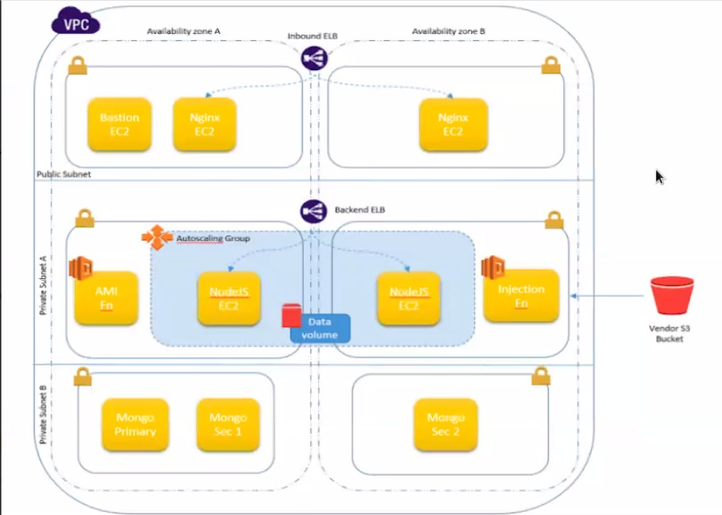
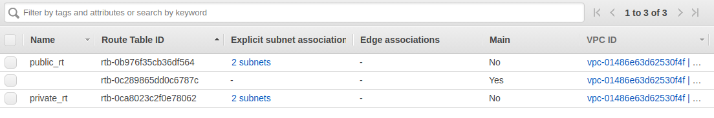
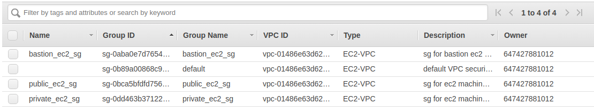
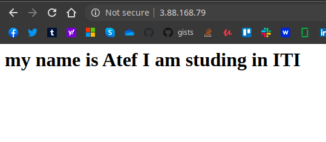
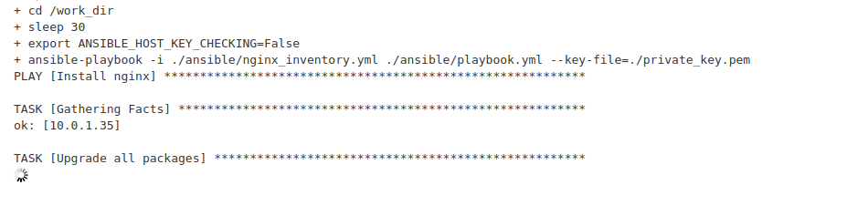

## Infrastructure as code using Terraform, Jenkins, Docker, Ansible, AWS

The goal is to apply an infrastructure close enough to the following structure:

## Resources created
- 2 public machines running nginx
- 1 ssh bastion machine
- 2 private machines running GOCD and sonatype's NEXUS 
- 1 main VPC
- 2 private subnets and 2 public subnets inside the main VPC
- 2 routing tables + 1 default
- 2 security groups + 1 default
- keypair [saved locally but added option to use AWS secrets-manger]

## Steps
- install docker && docker-compose
- create a file named `credentials` and add your AWS credentials to it
- run the follwing commands:
  - cd `docker`
  - `docker-compose up --build -d`
- open your browser and go to  `localhost:8081`
- complete jenkins setup steps
- after logging into jenkins, create a pipeline to run the jenkins file form SCM [jenkins_file](https://github.com/atefhares/terraform_playground/blob/master/lab2/jenkins_file)
- run the pipeline

## Screen shots

##
**this demo is created by students @ [ITI](http://iti.gov.eg/) - intake 40**
