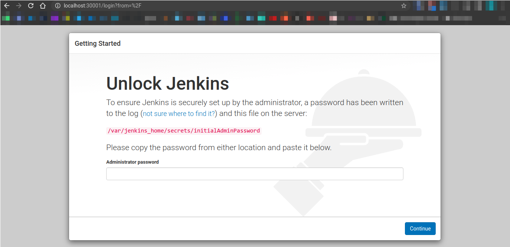
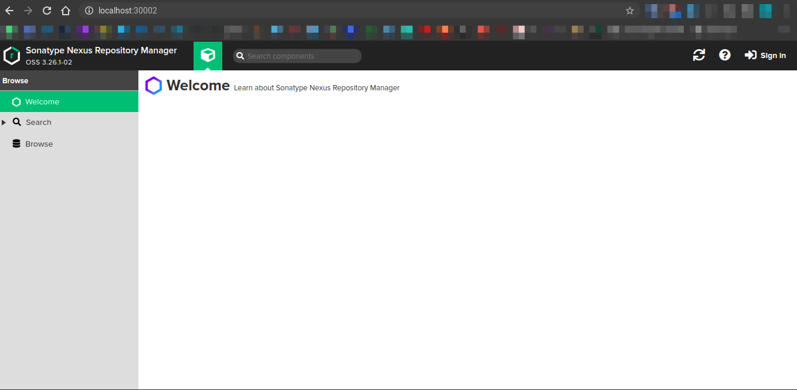
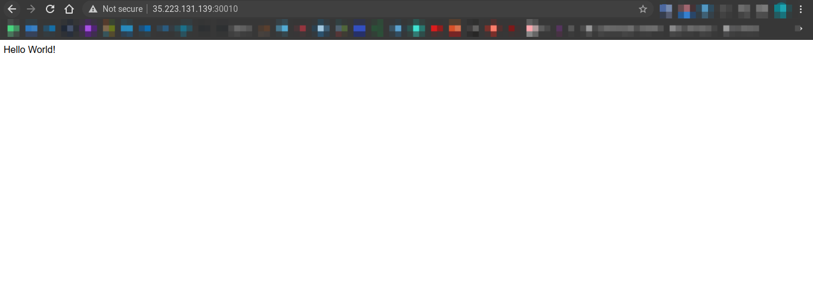
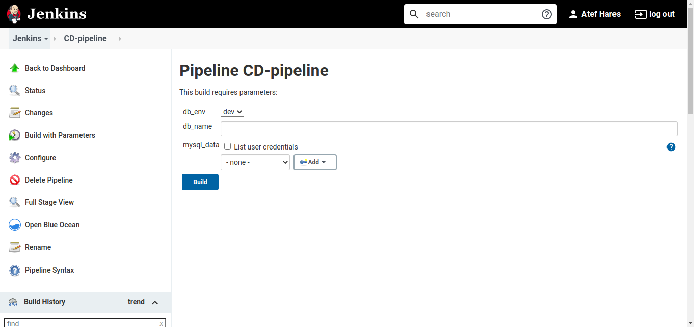
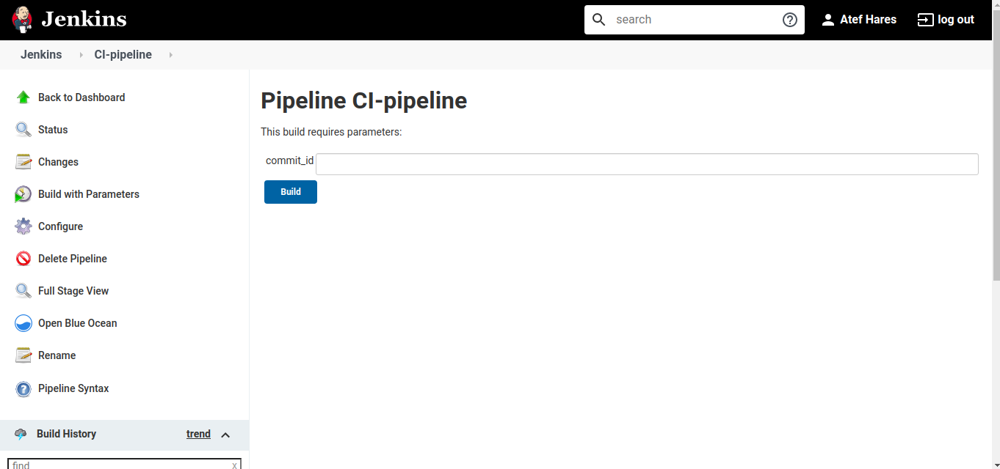
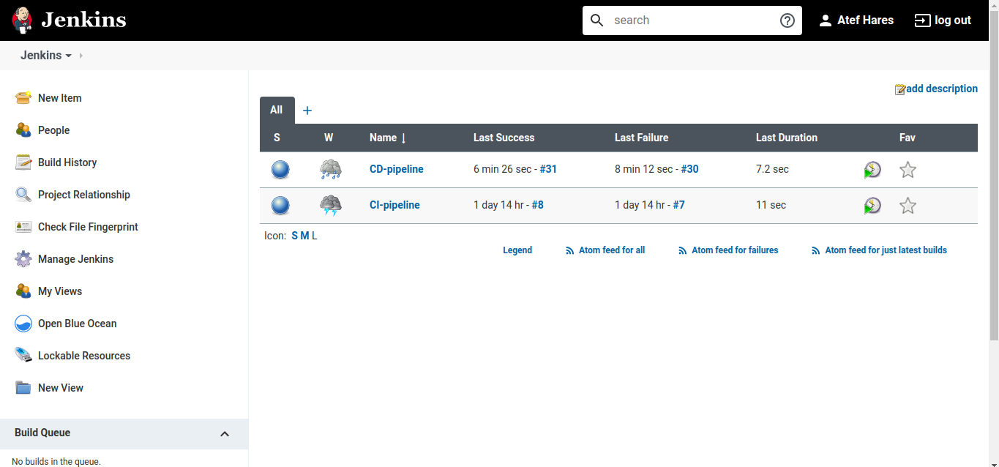

The goal is to use Terraform to setup kubernetes cluster contains the following resources:

## Resources created

- 3 namespaces (_build_, _dev_, _test_)
- 2 deployments in _build_ namespace, one for _jenkins_ and one for _sonatype-nexus_
- 1 deployment for _mysql_ database server in _dev_ & _test_ namespaces
- 1 service to access _jenkins_ externally
- 1 service to access _sonatype-nexus_ externally
- 1 service to access _mysql_ internally

## How to get started

- setup a Kubernetes cluster (you may use Minikube, GKS, EKS, etc)
- install terraform (you will my need additional setup steps depending on your K8s cluster service)
- run `terraform init`
- run `terraform plan` to check resources then use:

  `terraform apply -var="MYSQL_USER=?" -var="MYSQL_PASSWORD=?" -var="MYSQL_ROOT_PASSWORD=?"`

  to apply the changes

## outputs:

pipeline output:
<a href="pipelineoutput.txt"> pipelineoutput.txt </a>

---

---

---

---

---

---

